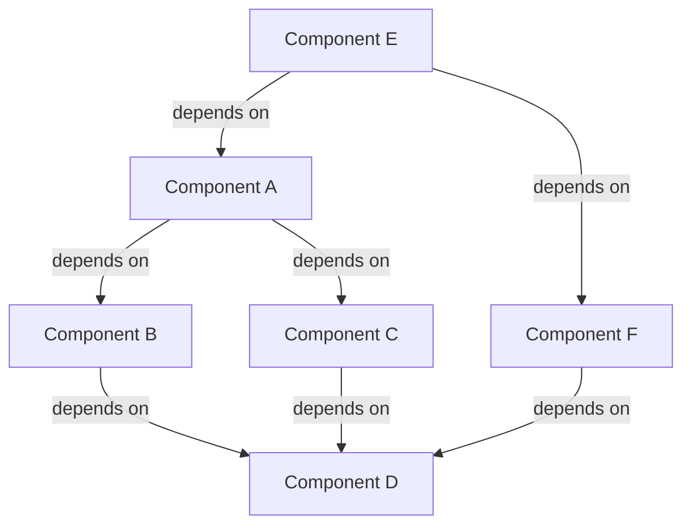

# Cross-Component Dependencies

## Purpose
This document maps dependencies between different components and domains of the system, providing a comprehensive view of how different parts interact and rely on each other.

## Classification
- **Domain:** Architecture
- **Stability:** Dynamic
- **Abstraction:** Structural
- **Confidence:** Evolving

## Content

### Dependency Overview

[Provide a high-level overview of the major dependencies in the system]

### Critical Path Dependencies

[Identify and describe dependencies that are on the critical path for system functionality]

1. **[Dependency 1]**
   - **Source:** [Component/Domain]
   - **Target:** [Component/Domain]
   - **Nature:** [What is depended upon]
   - **Criticality:** [High/Medium/Low]
   - **Impact if Broken:** [Description of impact]
   - **Verification Method:** [How to verify this dependency is satisfied]

2. **[Dependency 2]**
   - **Source:** [Component/Domain]
   - **Target:** [Component/Domain]
   - **Nature:** [What is depended upon]
   - **Criticality:** [High/Medium/Low]
   - **Impact if Broken:** [Description of impact]
   - **Verification Method:** [How to verify this dependency is satisfied]

### Dependency Matrix

| Component | Depends On | Depended On By | Nature of Dependency |
|-----------|------------|----------------|----------------------|
| [Component A] | [List of components] | [List of components] | [Description] |
| [Component B] | [List of components] | [List of components] | [Description] |
| [Component C] | [List of components] | [List of components] | [Description] |
| [Component D] | [List of components] | [List of components] | [Description] |
| [Component E] | [List of components] | [List of components] | [Description] |
| [Component F] | [List of components] | [List of components] | [Description] |

### Domain-Level Dependencies

#### [Domain 1]

**Outgoing Dependencies:**
- **To [Domain 2]:**
  - [Dependency description]
  - [Dependency description]
- **To [Domain 3]:**
  - [Dependency description]
  - [Dependency description]

**Incoming Dependencies:**
- **From [Domain 2]:**
  - [Dependency description]
  - [Dependency description]
- **From [Domain 4]:**
  - [Dependency description]
  - [Dependency description]

#### [Domain 2]

**Outgoing Dependencies:**
- **To [Domain 1]:**
  - [Dependency description]
  - [Dependency description]
- **To [Domain 3]:**
  - [Dependency description]
  - [Dependency description]

**Incoming Dependencies:**
- **From [Domain 1]:**
  - [Dependency description]
  - [Dependency description]
- **From [Domain 4]:**
  - [Dependency description]
  - [Dependency description]

### Dependency Management

#### Versioning Strategy

[Describe how versioning is managed across dependencies]

#### Breaking Change Protocol

[Describe the process for handling breaking changes in dependencies]

#### Dependency Monitoring

[Describe how dependencies are monitored for changes, updates, or issues]

### Dependency Risk Assessment

| Dependency | Risk Level | Potential Issues | Mitigation Strategy |
|------------|------------|------------------|---------------------|
| [Dependency 1] | [High/Medium/Low] | [Description of potential issues] | [Mitigation approach] |
| [Dependency 2] | [High/Medium/Low] | [Description of potential issues] | [Mitigation approach] |
| [Dependency 3] | [High/Medium/Low] | [Description of potential issues] | [Mitigation approach] |

## Relationships
- **Parent Nodes:** [foundation/architecture.md]
- **Child Nodes:** None
- **Related Nodes:** 
  - [cross-domain/interfaces.md] - details - Interfaces that implement dependencies
  - [decisions/*] - justifies - Decisions that established dependencies

## Navigation Guidance
- **Access Context:** Use this document when analyzing system structure, planning changes, or troubleshooting integration issues
- **Common Next Steps:** After reviewing dependencies, typically explore specific interfaces or component documentation
- **Related Tasks:** Architecture review, impact analysis, integration planning
- **Update Patterns:** This document should be updated whenever new dependencies are introduced or existing ones change

## Metadata
- **Created:** 5/14/2025
- **Last Updated:** 5/14/2025
- **Updated By:** System Setup

## Change History
- 5/14/2025: Initial creation of dependencies template
