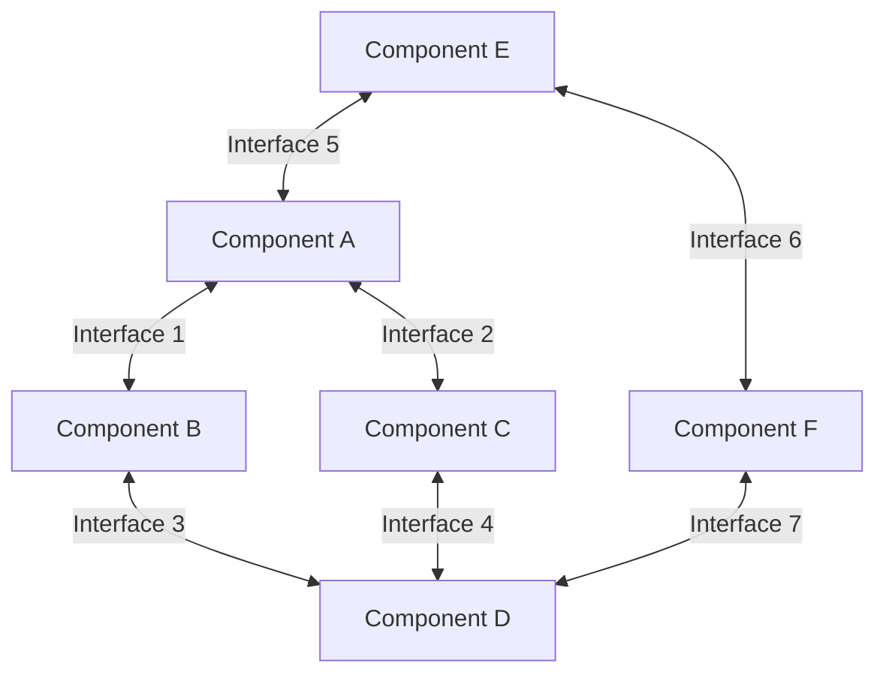

# System Interfaces

## Purpose
This document defines the interfaces between different components and domains of the system, providing a comprehensive reference for how different parts of the system communicate and interact.

## Classification
- **Domain:** Architecture
- **Stability:** Semi-stable
- **Abstraction:** Structural
- **Confidence:** Established

## Content

### Interface Overview

[Provide a high-level overview of the major interfaces in the system]



### Interface Definitions

#### Interface 1: [Interface Name]

**Type:** [API/Event/Data/UI/etc.]
**Purpose:** [Brief description of what this interface is for]

**Provider:** [Component/Domain that provides this interface]
**Consumers:** [Components/Domains that consume this interface]

**Contract:**
```
[Format appropriate to the interface type, such as:
- API specification
- Event schema
- Data format
- UI component props
- etc.]
```

**Usage Examples:**
```
[Examples of how to use this interface]
```

**Error Handling:**
[Description of how errors are handled across this interface]

**Performance Characteristics:**
[Description of performance expectations, such as latency, throughput, etc.]

**Security Considerations:**
[Description of security aspects of this interface]

**Versioning Strategy:**
[Description of how this interface is versioned]

#### Interface 2: [Interface Name]

**Type:** [API/Event/Data/UI/etc.]
**Purpose:** [Brief description of what this interface is for]

**Provider:** [Component/Domain that provides this interface]
**Consumers:** [Components/Domains that consume this interface]

**Contract:**
```
[Format appropriate to the interface type, such as:
- API specification
- Event schema
- Data format
- UI component props
- etc.]
```

**Usage Examples:**
```
[Examples of how to use this interface]
```

**Error Handling:**
[Description of how errors are handled across this interface]

**Performance Characteristics:**
[Description of performance expectations, such as latency, throughput, etc.]

**Security Considerations:**
[Description of security aspects of this interface]

**Versioning Strategy:**
[Description of how this interface is versioned]

### Interface Categories

#### API Interfaces

| Interface | Provider | Consumers | Purpose |
|-----------|----------|-----------|---------|
| [Interface Name] | [Provider] | [Consumers] | [Purpose] |
| [Interface Name] | [Provider] | [Consumers] | [Purpose] |
| [Interface Name] | [Provider] | [Consumers] | [Purpose] |

#### Event Interfaces

| Interface | Publisher | Subscribers | Purpose |
|-----------|-----------|------------|---------|
| [Interface Name] | [Publisher] | [Subscribers] | [Purpose] |
| [Interface Name] | [Publisher] | [Subscribers] | [Purpose] |
| [Interface Name] | [Publisher] | [Subscribers] | [Purpose] |

#### Data Interfaces

| Interface | Producer | Consumers | Purpose |
|-----------|----------|-----------|---------|
| [Interface Name] | [Producer] | [Consumers] | [Purpose] |
| [Interface Name] | [Producer] | [Consumers] | [Purpose] |
| [Interface Name] | [Producer] | [Consumers] | [Purpose] |

### Interface Governance

#### Interface Design Principles

[List and describe the principles that guide interface design]

#### Interface Review Process

[Describe the process for reviewing and approving new interfaces or changes to existing interfaces]

#### Interface Documentation Standards

[Describe the standards for documenting interfaces]

#### Interface Testing Requirements

[Describe the requirements for testing interfaces]

### Interface Evolution

#### Breaking Change Protocol

[Describe the process for handling breaking changes to interfaces]

#### Deprecation Process

[Describe the process for deprecating interfaces]

#### Interface Monitoring

[Describe how interfaces are monitored for usage, performance, and issues]

## Relationships
- **Parent Nodes:** [foundation/architecture.md]
- **Child Nodes:** None
- **Related Nodes:** 
  - [cross-domain/dependencies.md] - implements - Dependencies are realized through interfaces
  - [decisions/*] - justifies - Decisions that established interface designs

## Navigation Guidance
- **Access Context:** Use this document when designing component interactions, implementing integrations, or troubleshooting communication issues
- **Common Next Steps:** After reviewing interfaces, typically explore specific component documentation or dependency maps
- **Related Tasks:** API design, integration development, contract testing
- **Update Patterns:** This document should be updated whenever interfaces are added, modified, or deprecated

## Metadata
- **Created:** 5/14/2025
- **Last Updated:** 5/14/2025
- **Updated By:** System Setup

## Change History
- 5/14/2025: Initial creation of interfaces template
