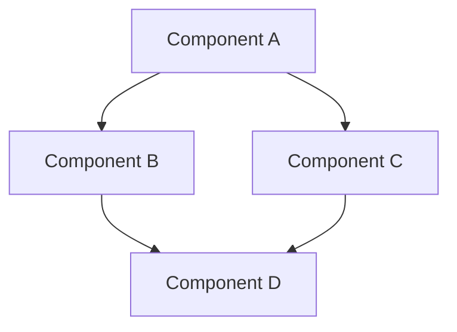

# System Architecture

## Purpose
This document provides an overview of the system architecture, including key components, their relationships, and the principles guiding their design.

## Classification
- **Domain:** Architecture
- **Stability:** Semi-stable
- **Abstraction:** Structural
- **Confidence:** Established

## Content

### Architecture Overview

[Provide a high-level description of the system architecture, including its major components and their relationships]

### Key Components

#### [Component A]
[Description of Component A, its purpose, responsibilities, and key characteristics]

#### [Component B]
[Description of Component B, its purpose, responsibilities, and key characteristics]

#### [Component C]
[Description of Component C, its purpose, responsibilities, and key characteristics]

#### [Component D]
[Description of Component D, its purpose, responsibilities, and key characteristics]

### Component Interactions

[Describe how the components interact with each other, including key interfaces, data flows, and dependencies]

### Technology Stack

| Layer | Technologies | Justification |
|-------|--------------|---------------|
| Frontend | [Technologies] | [Justification] |
| Backend | [Technologies] | [Justification] |
| Data Storage | [Technologies] | [Justification] |
| Infrastructure | [Technologies] | [Justification] |
| DevOps | [Technologies] | [Justification] |

### Quality Attributes

#### Performance
[Description of performance requirements and how the architecture addresses them]

#### Scalability
[Description of scalability requirements and how the architecture addresses them]

#### Security
[Description of security requirements and how the architecture addresses them]

#### Reliability
[Description of reliability requirements and how the architecture addresses them]

#### Maintainability
[Description of maintainability requirements and how the architecture addresses them]

### Deployment Architecture

[Description of how the system is deployed, including environments, infrastructure, and deployment processes]

### Future Evolution

[Description of how the architecture is expected to evolve over time, including planned changes and growth areas]

## Relationships
- **Parent Nodes:** [foundation/project_definition.md]
- **Child Nodes:** 
  - [domains/*/architecture.md] - details - Domain-specific architectural details
  - [decisions/*] - justifies - Architectural decisions that shaped this architecture
- **Related Nodes:** 
  - [foundation/principles.md] - guides - Principles that guided architectural decisions
  - [cross-domain/dependencies.md] - details - Dependencies between components
  - [cross-domain/interfaces.md] - specifies - Interfaces between components

## Navigation Guidance
- **Access Context:** Use this document when needing to understand the overall system structure and design
- **Common Next Steps:** After reviewing this architecture, typically explore specific domain architectures or decision records
- **Related Tasks:** System design, component development, integration planning
- **Update Patterns:** This document should be updated when there are significant changes to the system structure or technology stack

## Metadata
- **Created:** 5/14/2025
- **Last Updated:** 5/14/2025
- **Updated By:** System Setup

## Change History
- 5/14/2025: Initial creation of architecture overview template
