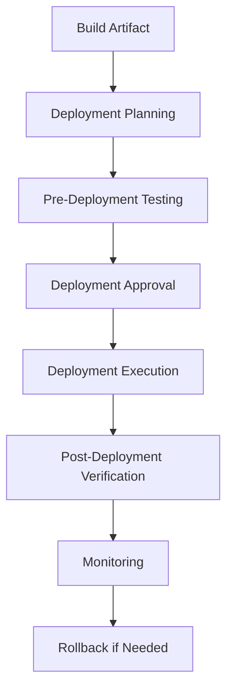
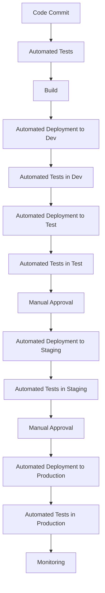

# Deployment Process

## Purpose
This document outlines the deployment process for the project, including strategies, procedures, and best practices.

## Classification
- **Domain:** Process
- **Stability:** Semi-stable
- **Abstraction:** Structural
- **Confidence:** Established

## Content

### Deployment Overview

[Provide a high-level overview of the deployment approach for the project]

### Deployment Environments

#### Development Environment

**Purpose:**
[Describe the purpose of the development environment]

**Deployment Frequency:**
[Describe how often deployments occur to this environment]

**Deployment Process:**
1. [Step 1]
2. [Step 2]
3. [Step 3]

**Access Control:**
[Describe who has access to deploy to this environment]

#### Testing Environment

**Purpose:**
[Describe the purpose of the testing environment]

**Deployment Frequency:**
[Describe how often deployments occur to this environment]

**Deployment Process:**
1. [Step 1]
2. [Step 2]
3. [Step 3]

**Access Control:**
[Describe who has access to deploy to this environment]

#### Staging Environment

**Purpose:**
[Describe the purpose of the staging environment]

**Deployment Frequency:**
[Describe how often deployments occur to this environment]

**Deployment Process:**
1. [Step 1]
2. [Step 2]
3. [Step 3]

**Access Control:**
[Describe who has access to deploy to this environment]

#### Production Environment

**Purpose:**
[Describe the purpose of the production environment]

**Deployment Frequency:**
[Describe how often deployments occur to this environment]

**Deployment Process:**
1. [Step 1]
2. [Step 2]
3. [Step 3]

**Access Control:**
[Describe who has access to deploy to this environment]

### Deployment Process Steps

#### 1. Build Artifact

**Activities:**
- [Activity 1]
- [Activity 2]
- [Activity 3]

**Outputs:**
- [Output 1]
- [Output 2]
- [Output 3]

**Tools:**
- [Tool 1]
- [Tool 2]
- [Tool 3]

#### 2. Deployment Planning

**Activities:**
- [Activity 1]
- [Activity 2]
- [Activity 3]

**Outputs:**
- [Output 1]
- [Output 2]
- [Output 3]

**Tools:**
- [Tool 1]
- [Tool 2]
- [Tool 3]

#### 3. Pre-Deployment Testing

**Activities:**
- [Activity 1]
- [Activity 2]
- [Activity 3]

**Outputs:**
- [Output 1]
- [Output 2]
- [Output 3]

**Tools:**
- [Tool 1]
- [Tool 2]
- [Tool 3]

#### 4. Deployment Approval

**Activities:**
- [Activity 1]
- [Activity 2]
- [Activity 3]

**Outputs:**
- [Output 1]
- [Output 2]
- [Output 3]

**Tools:**
- [Tool 1]
- [Tool 2]
- [Tool 3]

#### 5. Deployment Execution

**Activities:**
- [Activity 1]
- [Activity 2]
- [Activity 3]

**Outputs:**
- [Output 1]
- [Output 2]
- [Output 3]

**Tools:**
- [Tool 1]
- [Tool 2]
- [Tool 3]

#### 6. Post-Deployment Verification

**Activities:**
- [Activity 1]
- [Activity 2]
- [Activity 3]

**Outputs:**
- [Output 1]
- [Output 2]
- [Output 3]

**Tools:**
- [Tool 1]
- [Tool 2]
- [Tool 3]

#### 7. Monitoring

**Activities:**
- [Activity 1]
- [Activity 2]
- [Activity 3]

**Outputs:**
- [Output 1]
- [Output 2]
- [Output 3]

**Tools:**
- [Tool 1]
- [Tool 2]
- [Tool 3]

### Deployment Strategies

#### Blue-Green Deployment

[Describe the blue-green deployment strategy and when it is used]

#### Canary Deployment

[Describe the canary deployment strategy and when it is used]

#### Rolling Deployment

[Describe the rolling deployment strategy and when it is used]

#### Feature Flags

[Describe the use of feature flags in deployment]

### Rollback Procedures

[Describe the procedures for rolling back a deployment if issues are encountered]

#### Automated Rollback

[Describe the automated rollback process]

#### Manual Rollback

[Describe the manual rollback process]

### Deployment Schedule

[Describe the schedule for deployments, including blackout periods and preferred deployment windows]

### Deployment Documentation

#### Deployment Plan Template

[Provide a template for deployment plans]

#### Deployment Checklist

[Provide a checklist for deployments]

#### Deployment Report Template

[Provide a template for deployment reports]

### Continuous Deployment

[Describe the approach to continuous deployment, if applicable]

## Relationships
- **Parent Nodes:** [processes/development.md]
- **Child Nodes:** None
- **Related Nodes:** 
  - [processes/testing.md] - precedes - Testing precedes deployment
  - [foundation/architecture.md] - implements - Deployment implements architectural requirements

## Navigation Guidance
- **Access Context:** Use this document when planning or executing deployments, or when needing to understand the deployment process
- **Common Next Steps:** After reviewing the deployment process, typically explore specific deployment plans or checklists
- **Related Tasks:** Deployment planning, deployment execution, post-deployment verification
- **Update Patterns:** This document should be updated when deployment processes change or are refined

## Metadata
- **Created:** 5/14/2025
- **Last Updated:** 5/14/2025
- **Updated By:** System Setup

## Change History
- 5/14/2025: Initial creation of deployment process template
