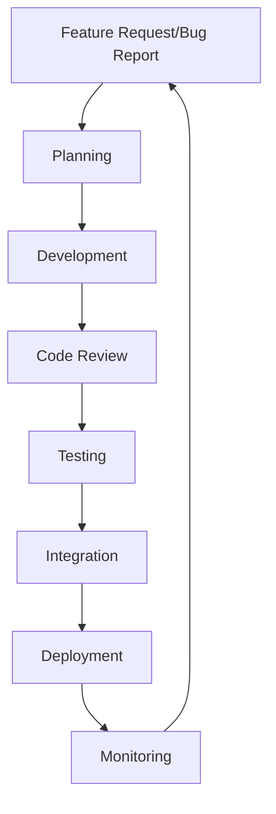
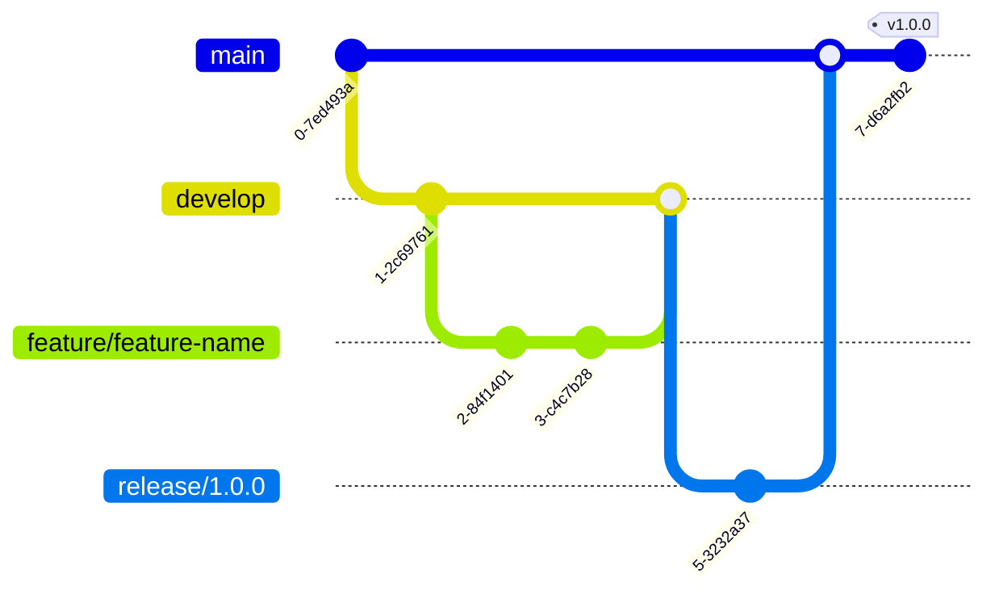
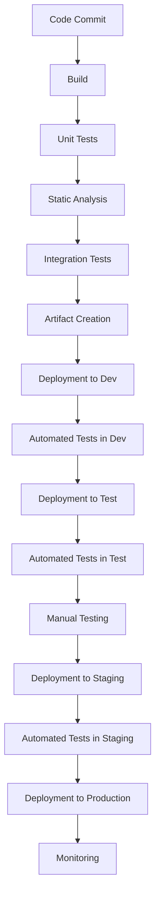

# Development Process

## Purpose
This document outlines the development process for the project, including workflows, standards, and best practices.

## Classification
- **Domain:** Process
- **Stability:** Semi-stable
- **Abstraction:** Structural
- **Confidence:** Established

## Content

### Development Workflow

[Provide a high-level overview of the development workflow]



### Development Environments

#### Local Development Environment

[Describe the setup and configuration of the local development environment]

**Prerequisites:**
- [Prerequisite 1]
- [Prerequisite 2]
- [Prerequisite 3]

**Setup Instructions:**
1. [Step 1]
2. [Step 2]
3. [Step 3]

**Running Locally:**
```
[Commands to run the application locally]
```

#### Development Environment

[Describe the shared development environment]

**Access:**
[Instructions for accessing the development environment]

**Usage Guidelines:**
[Guidelines for using the development environment]

#### Testing Environment

[Describe the testing environment]

**Access:**
[Instructions for accessing the testing environment]

**Usage Guidelines:**
[Guidelines for using the testing environment]

#### Staging Environment

[Describe the staging environment]

**Access:**
[Instructions for accessing the staging environment]

**Usage Guidelines:**
[Guidelines for using the staging environment]

#### Production Environment

[Describe the production environment]

**Access:**
[Instructions for accessing the production environment]

**Usage Guidelines:**
[Guidelines for using the production environment]

### Development Process Steps

#### 1. Planning

**Activities:**
- [Activity 1]
- [Activity 2]
- [Activity 3]

**Outputs:**
- [Output 1]
- [Output 2]
- [Output 3]

**Tools:**
- [Tool 1]
- [Tool 2]
- [Tool 3]

#### 2. Development

**Activities:**
- [Activity 1]
- [Activity 2]
- [Activity 3]

**Outputs:**
- [Output 1]
- [Output 2]
- [Output 3]

**Tools:**
- [Tool 1]
- [Tool 2]
- [Tool 3]

#### 3. Code Review

**Activities:**
- [Activity 1]
- [Activity 2]
- [Activity 3]

**Outputs:**
- [Output 1]
- [Output 2]
- [Output 3]

**Tools:**
- [Tool 1]
- [Tool 2]
- [Tool 3]

#### 4. Testing

**Activities:**
- [Activity 1]
- [Activity 2]
- [Activity 3]

**Outputs:**
- [Output 1]
- [Output 2]
- [Output 3]

**Tools:**
- [Tool 1]
- [Tool 2]
- [Tool 3]

#### 5. Integration

**Activities:**
- [Activity 1]
- [Activity 2]
- [Activity 3]

**Outputs:**
- [Output 1]
- [Output 2]
- [Output 3]

**Tools:**
- [Tool 1]
- [Tool 2]
- [Tool 3]

#### 6. Deployment

**Activities:**
- [Activity 1]
- [Activity 2]
- [Activity 3]

**Outputs:**
- [Output 1]
- [Output 2]
- [Output 3]

**Tools:**
- [Tool 1]
- [Tool 2]
- [Tool 3]

#### 7. Monitoring

**Activities:**
- [Activity 1]
- [Activity 2]
- [Activity 3]

**Outputs:**
- [Output 1]
- [Output 2]
- [Output 3]

**Tools:**
- [Tool 1]
- [Tool 2]
- [Tool 3]

### Coding Standards

[Describe the coding standards for the project]

#### General Guidelines

- [Guideline 1]
- [Guideline 2]
- [Guideline 3]

#### Language-Specific Guidelines

**[Language 1]:**
- [Guideline 1]
- [Guideline 2]
- [Guideline 3]

**[Language 2]:**
- [Guideline 1]
- [Guideline 2]
- [Guideline 3]

### Version Control

#### Branching Strategy

[Describe the branching strategy for the project]



#### Commit Message Guidelines

[Describe the guidelines for commit messages]

#### Pull Request Process

[Describe the process for creating and reviewing pull requests]

### Testing Strategy

[Describe the testing strategy for the project]

#### Unit Testing

[Describe the approach to unit testing]

#### Integration Testing

[Describe the approach to integration testing]

#### End-to-End Testing

[Describe the approach to end-to-end testing]

#### Performance Testing

[Describe the approach to performance testing]

### Documentation

[Describe the documentation requirements and processes]

#### Code Documentation

[Describe the requirements for code documentation]

#### API Documentation

[Describe the requirements for API documentation]

#### User Documentation

[Describe the requirements for user documentation]

### Continuous Integration/Continuous Deployment

[Describe the CI/CD pipeline for the project]



## Relationships
- **Parent Nodes:** [foundation/principles.md]
- **Child Nodes:** 
  - [processes/testing.md]
  - [processes/deployment.md]
- **Related Nodes:** 
  - [planning/roadmap.md] - implements - Development process implements roadmap items
  - [foundation/architecture.md] - follows - Development follows architectural guidelines

## Navigation Guidance
- **Access Context:** Use this document when onboarding new team members or when needing to understand or follow the development process
- **Common Next Steps:** After reviewing the development process, typically explore specific aspects like testing or deployment
- **Related Tasks:** Feature development, bug fixing, code review, testing
- **Update Patterns:** This document should be updated when development processes change or are refined

## Metadata
- **Created:** 5/14/2025
- **Last Updated:** 5/14/2025
- **Updated By:** System Setup

## Change History
- 5/14/2025: Initial creation of development process template
