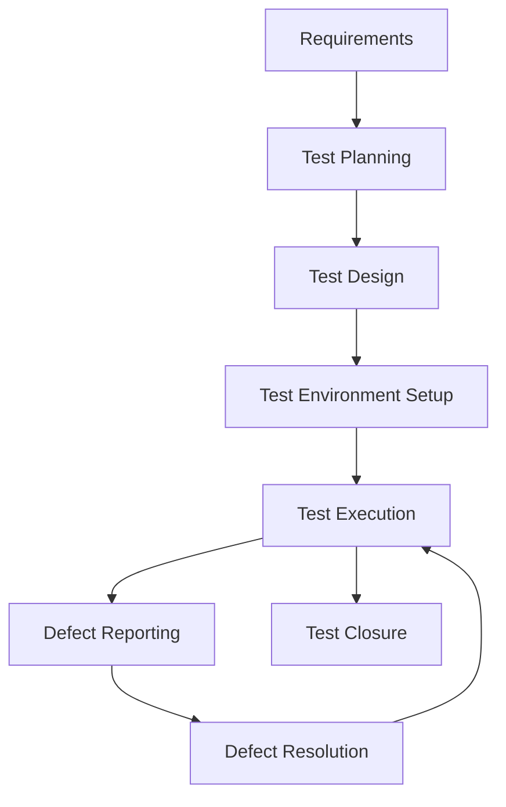
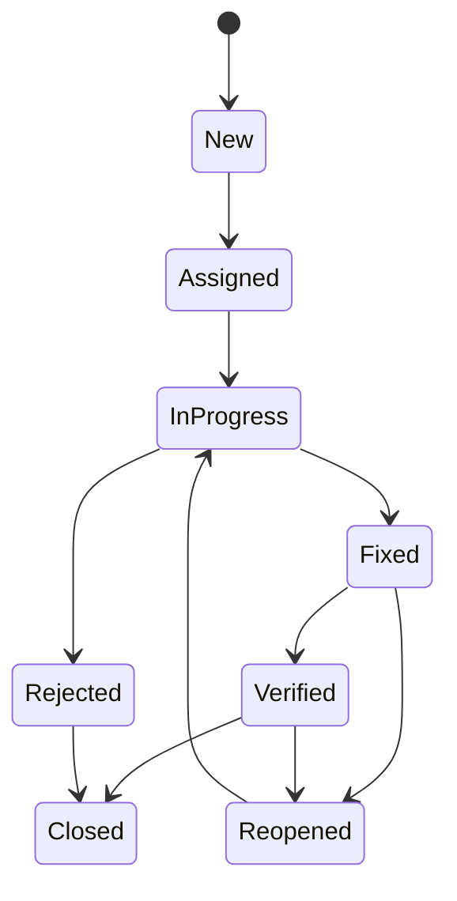

# Testing Process

## Purpose
This document outlines the testing process for the project, including strategies, methodologies, and best practices.

## Classification
- **Domain:** Process
- **Stability:** Semi-stable
- **Abstraction:** Structural
- **Confidence:** Established

## Content

### Testing Overview

[Provide a high-level overview of the testing approach for the project]



### Testing Levels

#### Unit Testing

**Purpose:**
[Describe the purpose of unit testing in the project]

**Responsibility:**
[Describe who is responsible for unit testing]

**Tools:**
- [Tool 1]
- [Tool 2]
- [Tool 3]

**Process:**
1. [Step 1]
2. [Step 2]
3. [Step 3]

**Coverage Requirements:**
[Describe the required coverage for unit tests]

**Examples:**
```
[Example unit test]
```

#### Integration Testing

**Purpose:**
[Describe the purpose of integration testing in the project]

**Responsibility:**
[Describe who is responsible for integration testing]

**Tools:**
- [Tool 1]
- [Tool 2]
- [Tool 3]

**Process:**
1. [Step 1]
2. [Step 2]
3. [Step 3]

**Coverage Requirements:**
[Describe the required coverage for integration tests]

**Examples:**
```
[Example integration test]
```

#### System Testing

**Purpose:**
[Describe the purpose of system testing in the project]

**Responsibility:**
[Describe who is responsible for system testing]

**Tools:**
- [Tool 1]
- [Tool 2]
- [Tool 3]

**Process:**
1. [Step 1]
2. [Step 2]
3. [Step 3]

**Coverage Requirements:**
[Describe the required coverage for system tests]

**Examples:**
```
[Example system test]
```

#### Acceptance Testing

**Purpose:**
[Describe the purpose of acceptance testing in the project]

**Responsibility:**
[Describe who is responsible for acceptance testing]

**Tools:**
- [Tool 1]
- [Tool 2]
- [Tool 3]

**Process:**
1. [Step 1]
2. [Step 2]
3. [Step 3]

**Coverage Requirements:**
[Describe the required coverage for acceptance tests]

**Examples:**
```
[Example acceptance test]
```

### Testing Types

#### Functional Testing

[Describe the approach to functional testing]

#### Performance Testing

[Describe the approach to performance testing]

#### Security Testing

[Describe the approach to security testing]

#### Usability Testing

[Describe the approach to usability testing]

#### Accessibility Testing

[Describe the approach to accessibility testing]

#### Compatibility Testing

[Describe the approach to compatibility testing]

### Test Environment Management

#### Test Environment Setup

[Describe the process for setting up test environments]

#### Test Data Management

[Describe the approach to managing test data]

#### Test Environment Maintenance

[Describe the process for maintaining test environments]

### Test Automation

#### Automation Strategy

[Describe the overall strategy for test automation]

#### Automation Framework

[Describe the test automation framework]

#### Automation Guidelines

[Provide guidelines for creating automated tests]

#### Continuous Integration

[Describe how automated tests are integrated into the CI/CD pipeline]

### Defect Management

#### Defect Lifecycle

[Describe the lifecycle of defects]



#### Defect Severity Levels

| Level | Description | Examples |
|-------|-------------|----------|
| Critical | [Description] | [Examples] |
| High | [Description] | [Examples] |
| Medium | [Description] | [Examples] |
| Low | [Description] | [Examples] |

#### Defect Priority Levels

| Level | Description | Response Time |
|-------|-------------|---------------|
| P1 | [Description] | [Response Time] |
| P2 | [Description] | [Response Time] |
| P3 | [Description] | [Response Time] |
| P4 | [Description] | [Response Time] |

#### Defect Reporting Guidelines

[Provide guidelines for reporting defects]

### Test Metrics and Reporting

#### Key Metrics

[Describe the key metrics used to measure testing effectiveness]

#### Reporting Frequency

[Describe how often test reports are generated]

#### Report Contents

[Describe what is included in test reports]

### Test Documentation

#### Test Plan

[Describe the structure and content of test plans]

#### Test Cases

[Describe the structure and content of test cases]

#### Test Scripts

[Describe the structure and content of test scripts]

#### Test Reports

[Describe the structure and content of test reports]

## Relationships
- **Parent Nodes:** [processes/development.md]
- **Child Nodes:** None
- **Related Nodes:** 
  - [processes/deployment.md] - precedes - Testing precedes deployment
  - [foundation/principles.md] - guided-by - Testing follows project principles

## Navigation Guidance
- **Access Context:** Use this document when planning or executing tests, or when needing to understand the testing process
- **Common Next Steps:** After reviewing the testing process, typically explore specific test plans or test cases
- **Related Tasks:** Test planning, test execution, defect management, test reporting
- **Update Patterns:** This document should be updated when testing processes change or are refined

## Metadata
- **Created:** 5/14/2025
- **Last Updated:** 5/14/2025
- **Updated By:** System Setup

## Change History
- 5/14/2025: Initial creation of testing process template
